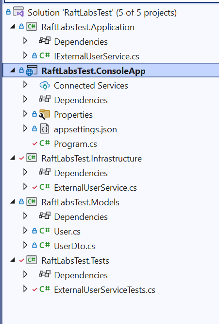
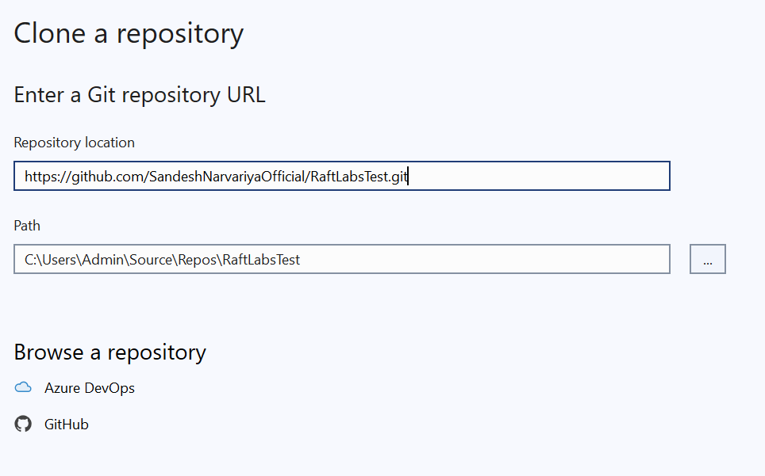
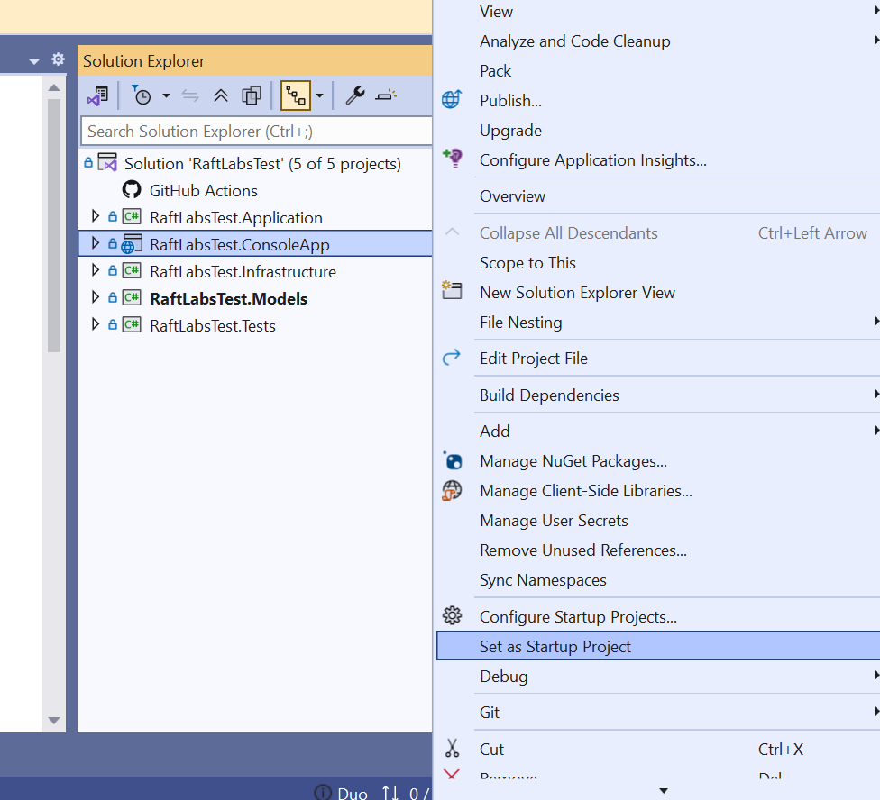
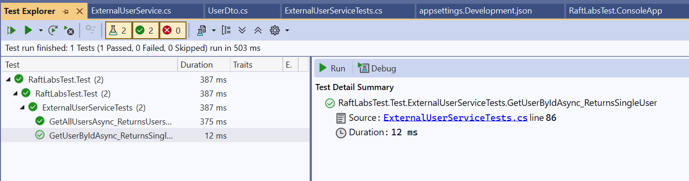

# RaftLabsTest
RaftLabsTest
│
├── RaftLabsTest.Application       # Service contracts/interfaces
├── RaftLabsTest.Infrastructure    # API client/service implementation
├── RaftLabsTest.Models            # DTOs and internal data models
├── RaftLabsTest.ConsoleApp        # Console app for demonstration
└── RaftLabsTest.Tests             # Unit tests for service logic

**Features**
* Fetch all users (handles pagination)
* Fetch single user by ID
* Async/Await and HttpClientFactory usage
* Centralized API base URL via appsettings.json
* Robust error handling (timeouts, not found, etc.)
* DTOs for structured API response mapping
* Unit testing using xUnit (or your preferred framework)
* Optional (Bonus):
    => In-memory caching using IMemoryCache
    => Retry policy support via Polly (to be optionally discussed/added)


## How To RUN
**Clone the Repository**

git clone https://github.com/SandeshNarvariyaOfficial/RaftLabsTest.git
cd RaftLabsTest

**Build the Solution**
dotnet build

**Run the Console App**
cd RaftLabsTest.ConsoleApp
dotnet run

**Running Tests**
cd RaftLabsTest.Tests
dotnet test


📁 ## Key Components
**Project	Purpose**
RaftLabsTest.Application:	Contains IExternalUserService interface
RaftLabsTest.Infrastructure:	Implements the API logic (ExternalUserService)
RaftLabsTest.Models:	DTOs for user and API responses
RaftLabsTest.ConsoleApp:	Sample CLI client to demonstrate the service
RaftLabsTest.Tests: 	Unit tests validating logic and behavior




**IF you want to use Visual Studio 2022 Than share screen short for run or text project.**
***Step 1: Clone the Repository***
Open Visual Studio 2022

Go to "File" > "Clone Repository..."

In the window that opens, paste your GitHub repo URL:

arduino
Copy
Edit
https://github.com/SandeshNarvariyaOfficial/RaftLabsTest.git
Choose a local path (e.g., C:\Users\Admin\Source\Repos\RaftLabsTest)

Click "Clone"




***Step 2: Set Console App as Startup Project***
In Solution Explorer, right-click on RaftLabsTest.ConsoleApp.

Click on "Set as Startup Project" from the context menu.




# ✅ Unit Tests – RaftLabsTest

This project includes **unit tests** for verifying integration with the [ReqRes](https://reqres.in) API using a mock-based approach.

## 🧪 Technologies Used

- [.NET 8](https://dotnet.microsoft.com/en-us/download)
- [xUnit](https://xunit.net/)
- [Moq](https://github.com/moq)
- [RichardSzalay.MockHttp](https://github.com/richardszalay/mockhttp)
- `Microsoft.Extensions.Caching.Memory`
- `System.Text.Json`

---

## 📁 Test Project Structure
RaftLabsTest.Test/
├── ExternalUserServiceTests.cs
├── UserDto.cs
└── Test Utilities...


---

## ✅ How to Run Tests in Visual Studio

1. **Open Solution**: Load `RaftLabsTest.sln` in Visual Studio.
2. **Build All Projects**:
   - `Build` > `Build Solution` (or press `Ctrl+Shift+B`).
3. **Set Test Project as Startup (optional)**:
   - Right-click on `RaftLabsTest.Test` > **Set as Startup Project**.
4. **Open Test Explorer**:
   - `Test` > `Test Explorer` or `Ctrl+E, T`.
5. **Run All Tests**:
   - Click ▶️ **Run All Tests** in Test Explorer.

---

## 🧪 Implemented Test Cases

| Method | Purpose |
|--------|---------|
| `GetAllUsersAsync_ReturnsUsersAcrossMultiplePages` | Verifies that paginated data is fetched across multiple pages and combined. |
| `GetAllUsersAsync_ReturnsCachedUsersIfPresent` | Ensures cache prevents unnecessary API calls. |
| `GetAllUsersAsync_StopsOnFailedApiResponse` | Confirms logic stops on failed HTTP response. |
| `GetUserByIdAsync_ReturnsSingleUser` | Validates fetching and mapping of a single user by ID. |

---

## 🔍 Example: Mocked Paginated Response

```csharp
mockHttp.When("https://reqres.in/api/users?page=1")
    .Respond("application/json", JsonSerializer.Serialize(page1));
mockHttp.When("https://reqres.in/api/users?page=2")
    .Respond("application/json", JsonSerializer.Serialize(page2));
mockHttp.When("https://reqres.in/api/users?page=3")
    .Respond("application/json", JsonSerializer.Serialize(new { data = new List<UserDto>() }));


